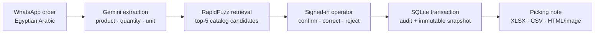

# Wholesale Order Parser

<p align="center">
  
</p>

<p align="center">
  <a href="https://github.com/Mohamed-Abdelaziz3/wholesale-order-parser/actions/workflows/ci.yml"></a>
  
  
  
  
</p>

<p align="center"><strong>من رسالة واتساب بالعامية المصرية إلى طلب مُراجع، مُعتمد، وقابل للتصدير — من غير ما النموذج يقرر بدل الإنسان.</strong></p>

Turns free-text wholesale orders written in Egyptian Arabic into structured,
catalog-matched orders with mandatory, attributable human review. The system
**narrows the catalog; it never decides.** Every line needs an explicit decision
from a signed-in operator before approval or export.

**Project artifacts:** [technical overview & pilot-readiness deck](docs/Wholesale_Order_Parser_Technical_Overview.pptx) · [GitHub readiness audit](docs/GITHUB_READINESS_AUDIT.md) · [release notes](CHANGELOG.md)

## Why this exists

Wholesale orders arrive as noisy voice-to-text, abbreviations, dialect, mixed
units, and product nicknames. A fully automatic SKU pick is unsafe on catalogs
with close variants; a manual re-entry workflow is slow and loses provenance.
This project keeps the useful part of automation — extraction and shortlist
generation — while making the commercial decision explicit, reviewable, and
auditable.

## Architecture



---

## Product flow

```
رسالة واتساب بالعامية
      │
      ▼
  Gemini extraction        →  (منتج، كمية، وحدة) لكل سطر
      │
      ▼
  RapidFuzz matching       →  أفضل 5 أصناف مرشّحة من الكتالوج
      │
      ▼
  مراجعة بشرية إجبارية      →  الترشيح مختار مسبقاً، والمراجع يأكّد أو يعدّل
      │
      ▼
  اعتماد بتوقيع + snapshot ثابت
      │
      ▼
  إذن صرف للتحميل (HTML/صورة) + CSV للمخزن
```

The downloadable document is an **internal picking / delivery note**
(`إذن صرف / أمر تحضير`). This build is not an ETA-integrated e-invoicing
provider: it has no e-signature, submits nothing to the Tax Authority, and
receives no UUID from it. Every generated document says so in a footer, and
`tests/test_document_and_settings.py` fails the build if any source file claims
otherwise. The optional `الكود الضريبي` field in shop settings is display text
only.

### Measured accuracy

| Setting | Result |
| --- | --- |
| 50-SKU catalog, live Gemini, 20 real messages | product 93.1% · quantity 100% · unit 100% · 0 silent errors |
| 400-SKU catalog of close variants, 192 queries | correct SKU **inside the shown top-5: 92.7%** · top-1: 48.4% |

The second row drives the product design: on a hard catalog the right answer is
in front of the reviewer ~93% of the time, even though picking it automatically
would be wrong about half the time. That is exactly why the human decision is
mandatory and why the shortlist — not the auto-pick — is the deliverable.

### Review → approval

<p align="center">
  
  
</p>

---

## Quick start

```bash
python -m venv .venv
source .venv/bin/activate          # Windows: .venv\Scripts\activate
pip install -r requirements.txt

cp .env.example .env               # Windows: Copy-Item .env.example .env
# edit .env: set GEMINI_API_KEY and APP_PASSWORD

uvicorn app.main:app --host 0.0.0.0 --port 8000
```

Open <http://localhost:8000>; you will be redirected to `/login`.

If `APP_PASSWORD` and `APP_USERS` are both unset, a random password is generated
and printed to the console at startup — the app is never accidentally open.

> **Dependency note:** extraction imports `from google import genai`, which comes
> from the **`google-genai`** package (declared in `requirements.txt`). The older
> `google-generativeai` package provides `google.generativeai` and does **not**
> satisfy this import.

### Tests

```bash
pip install -r requirements-dev.txt
ruff check app tests serve_demo.py
pytest --ignore=tests/test_live_gemini.py
pip-audit -r requirements.txt
```

The live Gemini test is excluded because it spends real API quota.

GitHub Actions repeats these gates on every push and pull request, builds the
Docker image, and runs scheduled CodeQL analysis. Dependabot watches Python,
GitHub Actions, and Docker dependencies weekly.

---

## Onboarding a merchant's catalog

The demo catalog (50 cleaning/packaging products) ships in `catalog.csv` and is
installed automatically on first run. For a real merchant:

1. Sign in → **إدارة الكتالوج** → **تحميل نموذج** to get a template.
2. They export their product list; upload the CSV or XLSX as-is.
3. The upload replaces the working catalog atomically and rebuilds the matcher.

The parser accepts:

* **CSV** (UTF-8, UTF-8-BOM, or **cp1256** — what Arabic Windows Excel produces)
  with comma, semicolon, or tab delimiters, and **XLSX/XLSM**.
* **English or Arabic headers**: `product_id` / `sku` / `كود المنتج`,
  `product_name` / `الصنف` / `اسم المنتج`, `aliases` / `مرادفات`,
  `unit` / `الوحدة`, `price` / `السعر`.
* Missing `aliases`, `unit`, or `price` columns, with a warning — dialect aliases
  measurably improve matching.

Duplicate codes, missing codes, and missing names are rejected with the offending
row number.

Replacing the catalog **cannot rewrite history**: approved snapshots store the
product name, unit, and price captured at approval time.

---

## Security model

| Control | Behaviour |
| --- | --- |
| Authentication | Required on every data endpoint. The only public routes are `/login`, `/api/login`, `/api/logout`, `/api/session`, `/api/health`. `/docs`, `/redoc` and `/openapi.json` are **disabled** unless `EXPOSE_API_DOCS=true`. |
| Reviewer identity | Taken from the **signed-in session**. A request whose `actor` disagrees with the session is rejected with `403` — never silently rewritten. |
| Sessions | Signed cookies (`itsdangerous`), 12 h default, `SESSION_HTTPS_ONLY=true` behind TLS. |
| Brute force | Login throttling keyed on **both** the client address and the account name, so a spoofed `X-Forwarded-For` cannot buy extra attempts. `X-Forwarded-For` is honoured only when `TRUST_PROXY_HEADERS=true`. |
| Stored XSS | Every untrusted value is HTML-escaped before it reaches the DOM. |
| CSV injection | Cells beginning `= + - @` are prefixed so Excel treats them as text. |
| Error responses | Generic messages to the client; details go to the server log only. |
| CSRF | State-changing requests must carry a same-origin `Origin`/`Referer`. `SameSite=Lax` alone is not enough: "same site" ignores the port, so another port on the same host — and any sibling subdomain — is same-site, and a `multipart/form-data` POST needs no preflight. |
| Browser hardening | CSP, anti-framing, `nosniff`, no-referrer, restricted browser capabilities, and `no-store` on sensitive responses. |
| Export semantics | CSV/XLSX exports are POST operations because they create immutable audit events; state-changing GET exports are rejected. |

**Known limitations, stated plainly:**

* **Single-tenant.** One deployment serves one merchant, one catalog, one
  database. Do not put two customers on one instance.
* **No per-order authorization.** Any signed-in operator can read and act on any
  order in that deployment.
* **Logout clears the client session but does not revoke the signed cookie**,
  which stays valid until `APP_SESSION_MAX_AGE` elapses.
* Keep the database **outside** any cloud-synced folder. SQLite in WAL mode
  writes `orders.db`, `orders.db-wal` and `orders.db-shm` as one atomic unit;
  OneDrive syncing them independently can corrupt or silently roll back data.
  Set `ORDERS_DB_PATH` to a path such as `C:\ProgramData\wop\orders.db`.

---

## Human-review contract

Every line decision is one complete, attributable, idempotent command:

```json
{
  "actor": "operator-name",
  "action_id": "review-<unique-id>",
  "final_decision": "SELECT",
  "selected_sku": "CL010",
  "quantity": 6,
  "unit": "قطعة"
}
```

`actor`, `action_id`, and `final_decision` are mandatory, and `actor` must equal
the signed-in operator. `SELECT` also requires SKU, quantity, and unit.
`NOT_FOUND` must not carry a SKU. Reusing an `action_id` with different content
is rejected.

Approval is a separate attributable command:

```json
{ "actor": "operator-name", "action_id": "approve-<unique-id>" }
```

Approval, its audit event, and the immutable snapshot are one transaction. Export
reads only that snapshot and refuses rows without verified review and approval
provenance. Human review never overwrites the original model recommendation or
its confidence.

`RR_K_AUTO_ACCEPT_ENABLED` is inert: a truthy value is logged and ignored.
Autonomous auto-accept is not available in this build.

---

## API

| Method | Path | Auth | Purpose |
| --- | --- | :---: | --- |
| GET | `/login` | – | Sign-in page |
| POST | `/api/login` | – | Start a session |
| POST | `/api/logout` | – | End the session |
| GET | `/api/session` | – | Who am I |
| GET | `/api/health` | – | Liveness probe |
| GET | `/` | ✔ | Review UI |
| POST | `/api/process` | ✔ | Extract + match one message |
| GET | `/api/orders` | ✔ | Recent orders |
| GET | `/api/orders/{id}` | ✔ | Working state + approved snapshot |
| POST | `/api/orders/{id}/items/{item}/review` | ✔ | Apply one line decision |
| PUT | `/api/orders/{id}/items/{item}` | ✔ | Compatibility alias |
| POST | `/api/orders/{id}/items/{item}/confirm-not-found` | ✔ | Compatibility NOT_FOUND |
| POST | `/api/orders/{id}/approve` | ✔ | Approve + snapshot |
| POST | `/api/orders/{id}/export` | ✔ | Export the verified snapshot as CSV + audit the export |
| POST | `/api/orders/{id}/export.xlsx` | ✔ | Export the verified snapshot as formatted XLSX + audit the export |
| GET | `/api/orders/{id}/document` | ✔ | Download the picking note (self-contained HTML) |
| GET | `/api/orders/{id}/audit` | ✔ | Audit events |
| GET | `/api/settings` | ✔ | Shop identity printed on the document |
| PUT | `/api/settings` | ✔ | Update shop identity (incl. base64 logo) |
| GET | `/api/catalog` | ✔ | Current catalog |
| GET | `/api/catalog/info` | ✔ | Catalog version metadata |
| GET | `/api/catalog/template` | ✔ | Download a catalog template |
| POST | `/api/catalog/upload` | ✔ | Replace the catalog (CSV/XLSX) |

---

## Timing metrics

The UI reports **measured** time only:

* Before approval it shows the automated processing time and states explicitly
  that no saving has been realised yet.
* After approval it shows the measured analysis→approval cycle against a clearly
  labelled manual baseline (45 s/line — an assumption, not a measurement;
  calibrate it against the merchant's real workflow).

---

## Deployment

See [DEPLOY.md](DEPLOY.md). `Dockerfile`, `Procfile`, `railway.json`, and
`fly.toml` are included. Set `ORDERS_DB_PATH` to a mounted volume so the SQLite
database survives redeploys.

---

## Migration from an older database

```python
from app.database import (
    preflight_human_review_migration,
    apply_human_review_migration,
    verify_human_review_migration,
)

preflight_human_review_migration("orders.db")   # read-only counts
# back up orders.db here
apply_human_review_migration("orders.db")
verify_human_review_migration("orders.db")
```

Startup refuses a legacy schema instead of rewriting it silently. Existing
snapshots are preserved but become legacy-unverified — and legacy-unverified
snapshots cannot be exported — unless matching attributable review and approval
events validate them. Never fabricate actors, action IDs, timestamps, or audit
events to make a row exportable.

---

## License

Released under the [MIT License](LICENSE). You may use, modify, and distribute
the software with attribution; it is provided without warranty.
